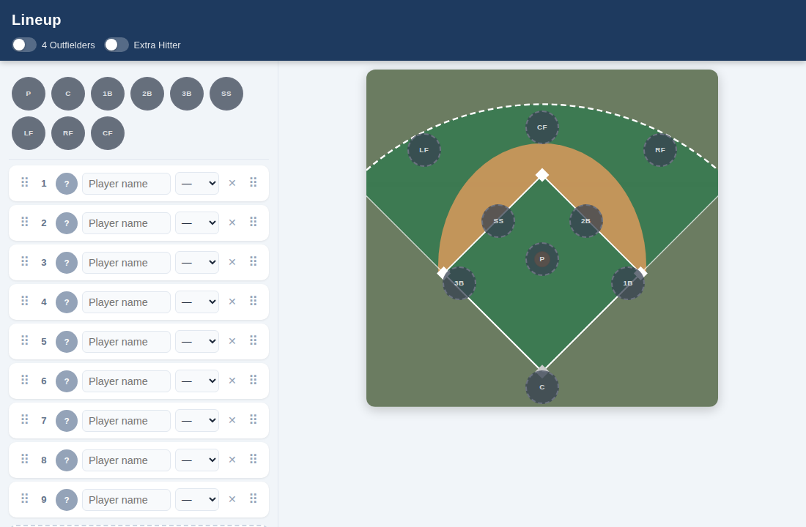
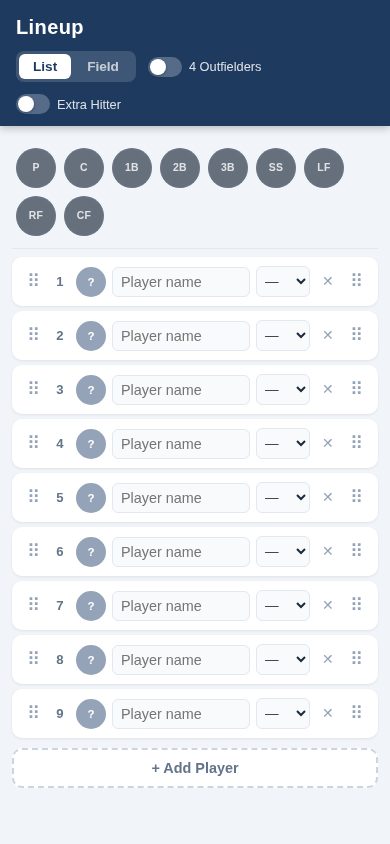

# Ebbets

A softball lineup manager React component.

**Desktop** — lineup list and field diagram side by side:



**Mobile** — single panel with List / Field tab toggle:

 Drag-and-drop batting order and field position assignment in one view, with support for 3 or 4 outfielders and an optional Extra Hitter.

## Features

- **List view** — ordered batting lineup with drag-to-reorder handles
- **Field view** — interactive diamond with draggable position chips
- **Cross-panel drag** — drag a player from the lineup list directly onto a field position
- **3 or 4 outfielders** — toggle between LF/CF/RF and LF/CL/CR/RF configurations
- **Extra Hitter** — manual or automatic; multiple EH slots when roster exceeds 10
- **Auto-config** — switches to 4OF automatically at 10 players; adds EH slots beyond 10
- **Responsive** — stacked tab layout on mobile, side-by-side panels on desktop (≥820px)
- **Self-contained CSS** — styles are injected by the JS bundle; no separate stylesheet needed

## Installation

```bash
npm install ebbets
```

React 17 or later is required as a peer dependency.

## Usage

`LineupManager` is a controlled component. Your application owns the state and passes it down.

```jsx
import { useState } from 'react'
import { LineupManager } from 'ebbets'

const COLORS = [
  '#dc2626', '#ea580c', '#d97706', '#16a34a',
  '#0891b2', '#2563eb', '#7c3aed', '#db2777',
]

const defaultRoster = () =>
  Array.from({ length: 9 }, (_, i) => ({
    id: i + 1,
    name: '',
    position: '',
    color: COLORS[i % COLORS.length],
  }))

export default function App() {
  const [players, setPlayers] = useState(defaultRoster)
  const [lineup, setLineup]   = useState({ outfield: '3', manualEH: false })

  const handleChange = ({ players: p, lineup: l }) => {
    setPlayers(p)
    setLineup(l)
  }

  return (
    <LineupManager
      players={players}
      lineup={lineup}
      onLineupChange={handleChange}
    />
  )
}
```

## Props

### `players` (required)

Array of player objects in batting order:

| Field | Type | Description |
|---|---|---|
| `id` | `number \| string` | Unique identifier |
| `name` | `string` | Player name (empty string if unset) |
| `position` | `string` | Assigned field position, e.g. `'SS'`, `'LF'`, `'EH'`, or `''` |
| `color` | `string` | CSS color used for the player's avatar chip |

### `lineup` (required)

Configuration object:

| Field | Type | Default | Description |
|---|---|---|---|
| `outfield` | `'3' \| '4'` | `'3'` | Outfield configuration. Overridden automatically when roster ≥ 10 |
| `manualEH` | `boolean` | `false` | Manually enable the Extra Hitter slot. Overridden automatically when roster > 10 |

### `onLineupChange` (required)

```ts
(state: { players: Player[], lineup: Lineup }) => void
```

Called on every change — reorder, name edit, position assignment, add/remove player, or toggle. Receives the full next state; replace both `players` and `lineup` in your state handler.

### `initialView` (optional)

`'lineup' | 'field'` — which panel is shown first on mobile. Defaults to `'lineup'`. Has no effect on desktop where both panels are always visible.

### `showTitle` (optional)

`boolean` — whether to render the "Lineup" `<h1>` heading. Defaults to `true`. Set to `false` when embedding the component inside a page that already provides its own heading. If `showTitle` is `false` and no toggle props are enabled, the header element is omitted entirely.

### Toggle props (optional)

The header toggles are hidden by default. Enable them individually as needed for testing or accessibility:

| Prop | Controls |
|---|---|
| `showViewToggle` | List / Field tab toggle (mobile only) |
| `showOutfieldToggle` | 4 Outfielders toggle |
| `showEHToggle` | Extra Hitter toggle |

All three default to `false`. When none are shown the controls bar is removed from the header entirely.

## Position reference

| Position | Notes |
|---|---|
| `P`, `C`, `1B`, `2B`, `3B`, `SS` | Always present |
| `LF`, `RF` | Always present |
| `CF` | 3-outfielder mode only |
| `CL`, `CR` | 4-outfielder mode only |
| `EH`, `EH2`, `EH3`, … | One per player beyond 10; or one if `manualEH` is true |

## Development

```bash
npm run dev          # Vite dev server (http://localhost:5173)
npm run storybook    # Storybook component explorer (http://localhost:6006)
```

## Testing

```bash
npm test             # Unit + component tests (Vitest + React Testing Library)
npm run test:watch   # Same, in watch mode
npm run test:e2e     # Browser tests (Playwright, requires dev server or starts one automatically)
```

The unit/component suite (`src/lineup.test.js`, `src/LineupManager.test.jsx`) runs in a headless DOM environment and covers all pure data functions and the rendered component. The Playwright suite (`tests/e2e/lineup.spec.js`) runs against a live dev server in both a desktop viewport (1024px) and a mobile viewport (390px).

## Building

```bash
npm run build        # Library build → dist/
npm run build:app    # Full app build (for hosting the demo)
```

The library build produces `dist/index.es.js` and `dist/index.cjs.js` with CSS injected at runtime.

## License

MIT
